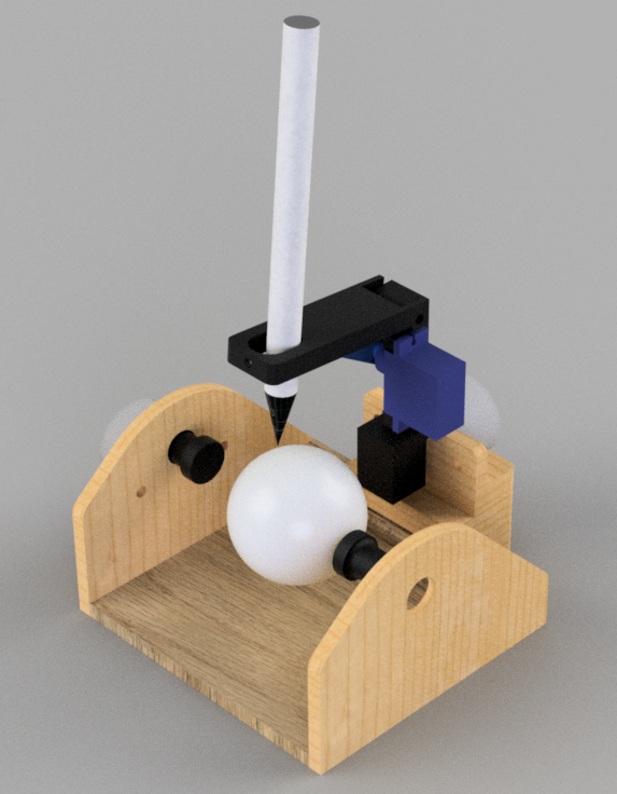

# GolfBot
Drawing a picture on a golf ball surface

* Project forked from [EggBot](https://github.com/evil-mad/EggBot)
* Project follows a GPLv3 license such as EggBot


## Works

1. Stepper motor has changed, from NEMA17 to 28BYJ-48.<br/>
   ( ULN2003 motor driver used )
2. Board has changed, from EggBot to Arduino <br/>
   ( Arduino Nano used)

## Installation

### 1. Firmware

- Built on arduino uno and arduino nano
- [Arduino sketch](https://www.arduino.cc/en/Main/Software)

### 2. Inkscape Extension

- Copy 'extension' folder into ```(Inkscape Installed Folder)/share```
- [Install guide](http://wiki.evilmadscientist.com/Installing_software)

### 3. Pre-built binary
- [Inkscape v0.91](https://inkscape.org/en/release/0.91/platforms/), extension included
- [Download](https://www.dropbox.com/s/5mejzrqb0vqasps/Inkscape_v0.91%2BExtension.zip?dl=1)

### 4. Tester Modeling



- Designed on Fusion360
- STL files for 3D Printing